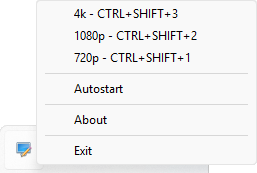

[](https://github.com/dominikcebula/ResoSwitch/actions/workflows/ci.yml)
[](https://sonarcloud.io/summary/new_code?id=dominikcebula_ResoSwitch)
[](https://sonarcloud.io/summary/new_code?id=dominikcebula_ResoSwitch)
[](https://sonarcloud.io/summary/new_code?id=dominikcebula_ResoSwitch)
[](https://sonarcloud.io/summary/new_code?id=dominikcebula_ResoSwitch)
[](https://sonarcloud.io/summary/new_code?id=dominikcebula_ResoSwitch)
[](https://sonarcloud.io/summary/new_code?id=dominikcebula_ResoSwitch)

# ResoSwitch

**ResoSwitch** is a lightweight Windows tray application that lets you instantly switch between custom screen
resolutions using a global keyboard shortcut or tray menu. It is ideal for developers, gamers, streamers, and anyone who
frequently changes display settings.



---

## ✨ Features

- ⚡ Instantly switch resolutions with a global hotkey or tray menu
- 🛠️ Fully customizable resolution presets and shortcuts via an INI file
- 🧵 Minimal resource usage
- 🪟 Native Windows support (no dependencies)
- 🖥️ Runs quietly in the system tray
- 🗂️ Auto-generates config file on first run
- 🔄 **Autostart**: Enable or disable app autostart directly from the tray menu (checkbox)

---

## 💡 Motivation

I often found myself needing to switch my screen resolution from 4k to 1080p during remote meetings. While 4k is perfect
for my own work, it makes shared screens hard to read for others. Manually changing the resolution each time was tedious
and disruptive. ResoSwitch was created to make this process instant and effortless, so I can quickly adapt my display
for better readability and collaboration—without breaking my workflow.

---

## 🔧 Use Cases

- Quickly switch to a lower resolution for screen sharing, gaming, or recording, then revert to native
- Improve readability or accessibility by toggling larger resolutions
- Set up any number of custom resolutions and shortcuts for your workflow

---

## 📦 Installation

1. Download the latest release from [Releases](https://github.com/yourusername/ResoSwitch/releases)
2. Place `ResoSwitch.exe` anywhere you like
3. Run the app (it will create `ResoSwitch.ini` if not present)
4. Edit `ResoSwitch.ini` to add or change resolution presets and shortcuts
5. Use the tray icon or your shortcuts to switch resolutions instantly

---

## 🛠️ Building from Source

```bash
git clone https://github.com/yourusername/ResoSwitch.git
cd ResoSwitch
# Open in Visual Studio or your preferred C++ IDE
# Or use CMake to build
```

---

## ⚙️ Configuration

- The app uses an INI file named after the executable (e.g., `ResoSwitch.ini`).
- Each resolution is a section with `label`, `width`, `height`, and `shortcut` attributes.
- **Autostart** can be toggled from the tray menu. When enabled, the app will start automatically with Windows; when
  disabled, it will not.
- Example:

```
[4k]
label=4k
width=3840
height=2160
shortcut=CTRL+SHIFT+3

[1080p]
label=1080p
width=1920
height=1080
shortcut=CTRL+SHIFT+2
```

---

## 🛠 Tech Stack

- C++23
- Windows API (native Windows programming)
- CMake (build system)
- cl (Visual Studio C++ compiler)
- Windows Resource Scripts
- GitHub Actions (CI/CD)

---

## 📝 License

MIT License. See [LICENSE](LICENSE) for details.

## 👨‍💻 Author

Dominik Cebula

* https://dominikcebula.com/
* https://blog.dominikcebula.com/
* https://www.udemy.com/user/dominik-cebula/
